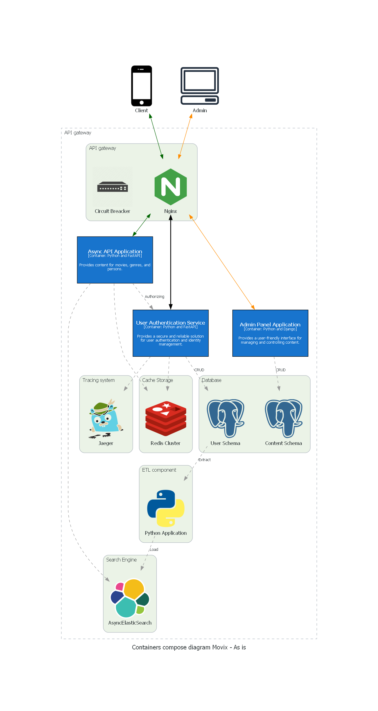
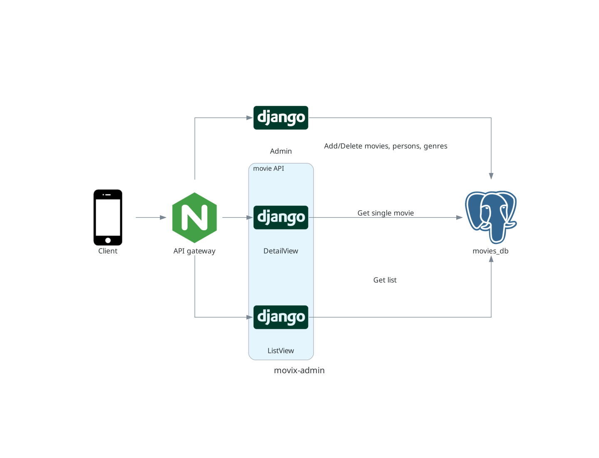
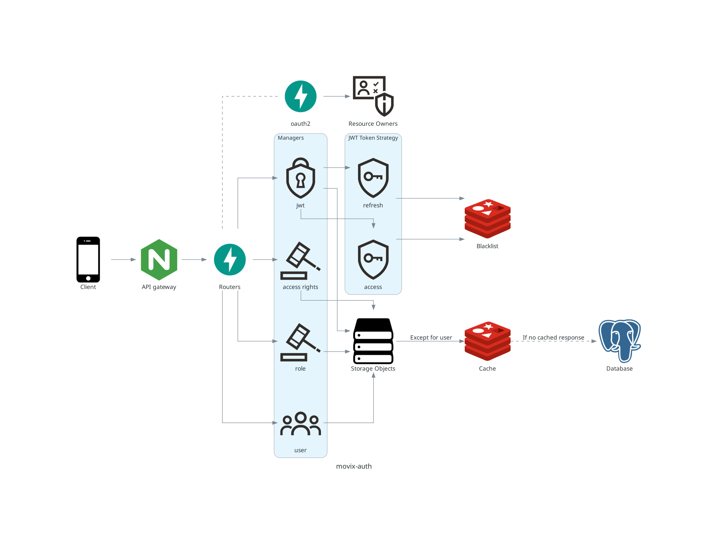
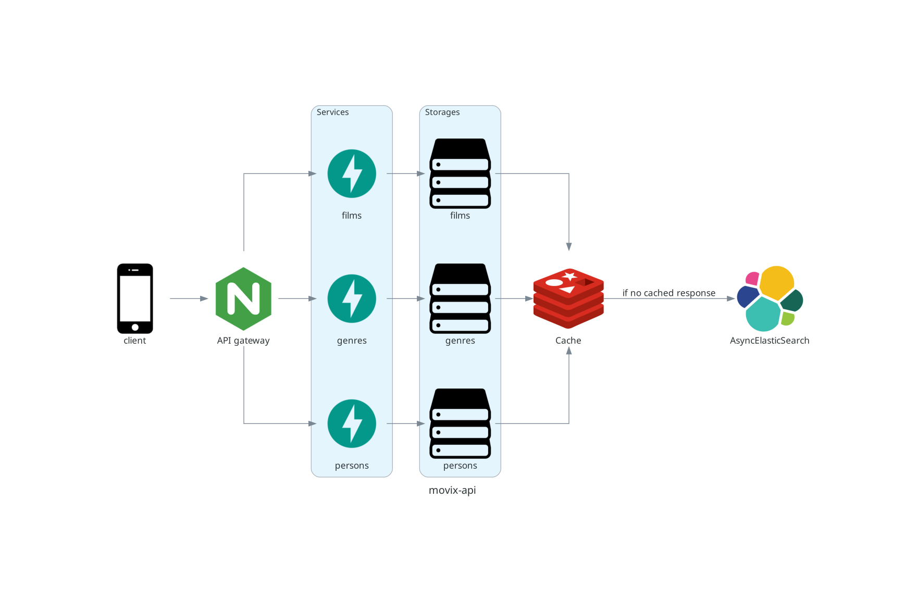
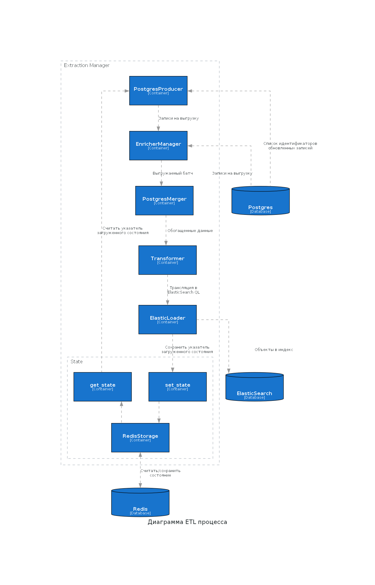
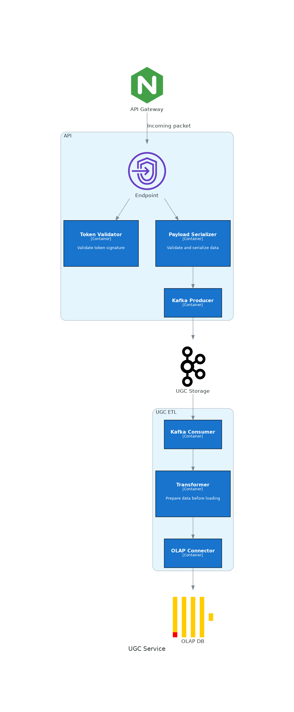

# Movix

[](https://github.com/stranded-in-python/movix-api/actions/workflows/ci.yml)
[](https://github.com/stranded-in-python/movix-etl/actions/workflows/ci.yml)
[](https://github.com/stranded-in-python/movix-admin/actions/workflows/ci.yml)
[](https://github.com/stranded-in-python/movix-auth/actions/workflows/ci.yml)
[](https://github.com/stranded-in-python/movix-ugc/actions/workflows/ci.yml)

[](https://github.com/stranded-in-python/movix-notification-worker/actions/workflows/ci.yml)
[](https://github.com/stranded-in-python/movix-notification-api/actions/workflows/ci.yml)
[](https://github.com/stranded-in-python/movix-notification-scheduler/actions/workflows/ci.yml)

## What is this?

This is a project of 11th group of 25th stream (previously 7th of 24th) of Yandex Practicum for Middle Python Developers. The goal of the project is to build a online streaming platform.

## What is under the hood?

Django 4.1, Elasticsearch, Redis, Postgres, FastAPI

### Project Architecture

<details>
<summary>Scheme of Movix app</summary>



</details>

<details>
<summary>Scheme of Movix-admin</summary>



</details>

<details>
<summary>Scheme of Movix-auth</summary>



</details>

<details>
<summary>Scheme of Movix-api</summary>



</details>

<details>
<summary>Scheme of Movix-etl</summary>



</details>

<details>
<summary>Scheme of Movix-UGC</summary>



</details>

## How to install

You need to make shure, that ElasticSearch is configured properly on your machine to run this project: [StackOverflow Link](https://stackoverflow.com/questions/51445846/elasticsearch-max-virtual-memory-areas-vm-max-map-count-65530-is-too-low-inc)

For starters, we need to initialize the project:

```bash
git clone git@github.com:stranded-in-python/movix.git && cd movix && make init
```

For local up (whithout Kafka):

```bash
make up
```

For local up with Kafka:

```bash
make upfull
```

To stop all containers:

```
make down
```

## Deployment

For deployment you could use [Docker Swarm](https://docs.docker.com/engine/swarm/).

Configure Swarm, as described in [manual](https://dockerswarm.rocks/).

Then you need to create .env files for production at `.envs/.production`.
An example what .env files should look like lies at `.envs/.production.example/*`.

Then run:

```
export COMPOSE_PROJECT_NAME=movix_production
docker stack deploy -c production.yml -c kafka.yml
```
